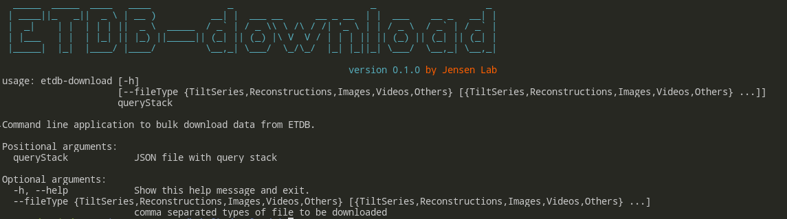
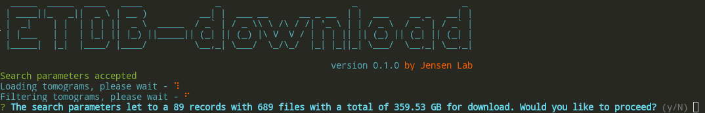

# ETDB-download :: User manual

The goal of this manual is to let users of ETDB to easily download files from the ETDB-Caltech.

## Install

This application is a command-line, `nodejs` application and the first thing you need to do is to get a bit familiar with command line. In this tutorial we will assume that the user is in a some sort of `unix` related environment.

### Install nodejs.

The easiest way to install nodejs is by using `nvm` or [Node Version Manager](https://github.com/creationix/nvm).

From their github page you can install nvm by doing:

```bash
$ curl -o- https://raw.githubusercontent.com/creationix/nvm/v0.33.11/install.sh | bash
```

you might need to close your terminal and reopen, but the next time you type `nvm` you should see a menu with options.

Please refer to google if you have trouble to install `nvm`.

...and that was probably the hardest part, because now you can install `node 9.10.1` with:

```
$ nvm install  9.10.1
```

and make it the default:

```
$ nvm alias default 9.10.1
```

You should be all set and if so, you will be able to do this:

```bash
$ node
> 2 + 2
4
> 
```

Hit Ctrl-d to get out.

## Installing ETDB-download

ETDB-download is on npm under the name [etdb-bulk-download](https://www.npmjs.com/package/etdb-bulk-download) and to install simply:

```
$ npm install -g etdb-bulk-download
```

you should be all set. You can test it using:

```
$ etdb-download -h
```

and something like this should come up:



## Using ETDB-download.

> Important note: ETDB is a large database, so be aware that ETDB-download might fill up your disk with data if you are not paying attention.

The only mandatory argument of ETDB-download is a `JSON` formated file that contains the search (or filtering) parameters. ETDB-download uses another package called [`complex-filter`](https://www.npmjs.com/package/complex-filter) and you can find much more information on how to write a `searchParamenter` file that is compatible with ETDB-download.

As you probably know by now, ETDB uses the [Open Index Protocol](https://oip.wiki) to deposit the metadata of the tomograms in the [FLO blockchain](https://flo.cash). Thus, the first information that you need is the format of the OIP `artifact` for tomograms and you can find this info [here](https://oip.wiki/Research-Tomogram). All these fields are accessible to the search parameter but what you are probably more interested is in the section `artifact.details`

So, let's suppose we would like to download all the tomograms from _Pseudomonas aeruginosa_. To do that, you will need a file containing the following:

```json
[
    {
		"type": "filter",
		"searchOn": "artifact.details.speciesName",
		"searchType": "exact",
		"searchFor": "Pseudomonas aeruginosa"
	}
]
```

Please refer to the documentation of [`complex-filter`](https://www.npmjs.com/package/complex-filter) for the details on how this works, but it should be straight forward: This is a `filter` type of parameter that will `searchOn` `artifact.details.speciesName` field for a `exact` match with the `Pseudomonas aeruginosa`.

let's save this file as `Ps.aer.searchPar.json` in the same directory you would like to run `etdb-download` and then run:

```
$ etdb-download Ps.aer.searchPar.json
```

which after a little bit should retrieve the tomogram metadata from OIP and select only tomograms from _Pseudomonas aeruginosa_.



ETDB-Download alerts you that there are 89 datasets with a total of 689 files and a total of 359.53 GB to download. If you answer `YES` to this question, ETDB will start downloading all of it.

Please take a moment to search around the [ETDB-Caltech](https://etdb.caltech.edu) and test a couple search conditions using the `Advanced search`, however, `complex-filter` allows for a more complex association of `AND`, `OR` and `NOT`.

### --fileType option

The default of ETDB-download is to download all the files from the dataset. We can change that by using the options `--fileType`. You can pick one or more of the following:

| File types allowed for download |
|:-:|
| TiltSeries |
| Reconstructions |
| Images |
| Videos |
| Others |
| None |


For example, let's say that we are only interested in the raw tilt series and the reconstructions. We should then do:

```
$ etdb-download Ps.aer.searchPar.json --fileType TiltSeries Reconstructions
```


which leads to less files but with still a large amount of data to download.

If you are unsure, I would recommend to first download only the metadata by picking `None` in `--fileType`.

> Note that `None` have precedence to any other type of files and it will ignore other types. Think as a _dry run_ option.

 


